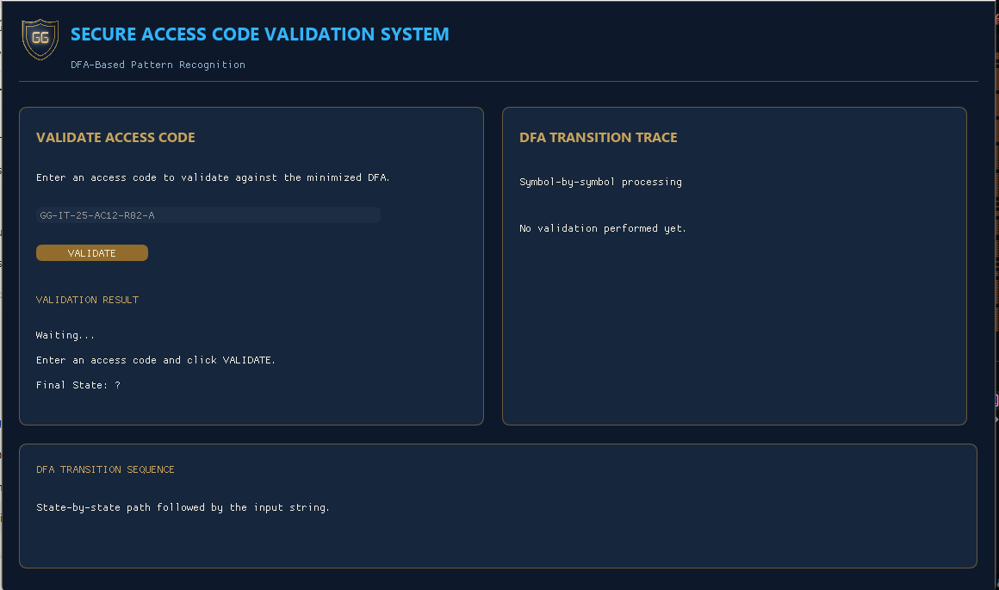
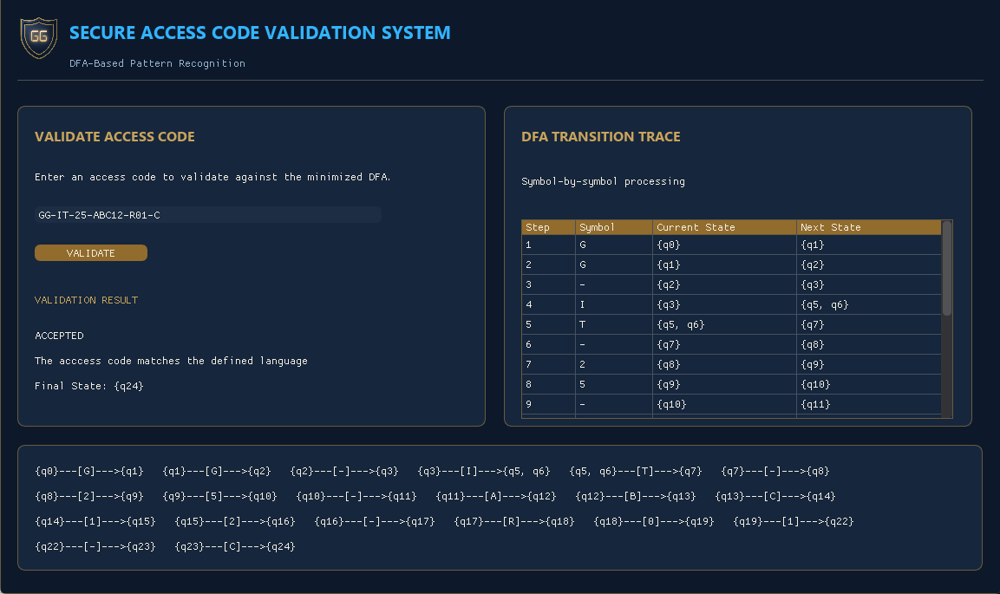

# Secure Access Code Validation System

A Python-based application that validates access codes using **Deterministic Finite Automata (DFA)** and regular expressions. It provides a graphical interface for checking whether access codes follow the required format.

## System Preview

### Before Validation


### Successful Validation


## Access Code Format

`GG-DEPT-YY-ID-RNN-LEVEL`

**Example:** `GG-CS-25-ABC-R05-A`

| Component | Description |
|---|---|
| `GG` | System prefix |
| `DEPT` | IT, CS, or IS |
| `YY` | Year code, 25–29 |
| `ID` | 3–5 characters using A, B, C, or digits |
| `RNN` | Resource number, R01–R20 |
| `LEVEL` | Access level A, B, or C |

## Features

- DFA-based access code validation
- Regular expression validation
- Graphical user interface
- Automated test cases

## Technologies

- Python
- Dear PyGui
- JSON
- Regular Expressions

## Project Structure

```text
secure-access-code-validator/
├── assets/
│   ├── GG_fixed.png
│   └── GG.png
├── data/
│   └── dfa.json
├── images/
│   ├── before-validation.png
│   └── successful-validation.png
├── src/
│   ├── automata/
│   │   ├── alphabet.py
│   │   └── dfa.py
│   ├── gui/
│   │   └── system_gui.py
│   └── validator/
│       └── validator.py
├── test case/
│   ├── test_validator.py
│   └── testcase.md
├── main.py
└── README.md
```

## Installation and Usage

1. Clone the repository:

   ```bash
   git clone <YOUR-REPOSITORY-URL>
   cd secure-access-code-validator
   ```

2. Install the required GUI library:

   ```bash
   pip install dearpygui
   ```

3. Run the application:

   ```bash
   python main.py
   ```

## Running Tests

```bash
python -m unittest -v "test case/test_validator.py"
```

## Limitations

This project is intended for educational purposes. It validates access code formats but does not implement encryption or cryptographic security.